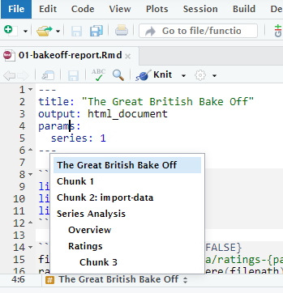

```{r setup, include=FALSE}
options(htmltools.dir.version = FALSE)
episode_counter <- 0
knitr::opts_chunk$set(
  collapse = TRUE,   
  comment = "#>"
)
```

```{r packages, include=FALSE}
library(countdown)
library(ymlthis)
library(tidyverse)
library(bakeoff)
library(xaringanExtra)

xaringanExtra::use_clipboard()
xaringanExtra::use_share_again() # need to get the slide button on html view
```

class: title-slide, center, middle

<span class="fa-stack fa-4x">
  <i class="fa fa-circle fa-stack-2x" style="color: #ffffffcc;"></i>
  <strong class="fa-stack-1x" style="color:#e7553c;">`r rmarkdown::metadata$session`</strong>
</span> 

# `r rmarkdown::metadata$title`

---

class: inverse, center, middle

# <center>Understanding Code chunks</center>

<span class="fa-stack fa-4x">
  <i class="fa fa-circle fa-stack-2x" style="color: #fff;"></i>
  <strong class="fa-stack-1x" style="color:#17a2b8;">`r (episode_counter <- episode_counter + 1)` </strong>
</span> 

# <i class="fab fa-r-project"></i> code

---

class: live-code

# Adding/running chunks

Together we open RMarkdown script `01-bakeoff-report.Rmd`:

1. Add chunks with button or:

   Ctrl + Alt + `i` (Windows/Linux)
   
   Command (or Cmd) `⌘` + Option (or Alt) `⌥` +  `i` (Mac)
   
1. Run chunks by:

   Run current chunk button (green triangle at top of chunk)
   
   Knit button / run all chunks (grey arrow down and green bar)
   
   Short menu at top of Editor

???

Shortcut key to run a chunk `Ctrl + Shift + Enter`

Some computers return an ì when `Ctrl + Alt + i` is used. Possibly to do with the Fn layout on the keyboard?

Might need the shortcut to be added/amended `Tools/Modify Keyboard Shortcuts...`

---

# <center>Default Code chunk</center>

.pull-left[

````
```{r}`r ''`
ratings %>% 
  filter(series == 1) %>% 
  top_n(1, viewers_7day)
```
````

Let's see the fate of this chunk?

]

--

.pull-right[

```{r}
ratings %>% 
  filter(series == 1) %>% 
  top_n(1, viewers_7day)
```

]

???

This is a view of the data that would normally go to the Console so includes information
like data types.

Copy and paste into the `01-bakeoff-report.Rmd` and knit to see it in the report.

---

# <center>Object creating Code chunk</center>

.pull-left[

````
```{r}`r ''`
top_viewers <- ratings %>% 
  filter(series == 1) %>% 
  top_n(1, viewers_7day)
```
````

What happens here if we create an object?

]

--

.pull-right[

```{r}
top_viewers <- ratings %>% 
  filter(series == 1) %>% 
  top_n(1, viewers_7day)
```
]

???

Not quite what we expect as this is just the code showing, not the results, which is the main aim of RMarkdown. 

---

# <center>Showing object Code chunk</center>

.pull-left[

````
```{r}`r ''`
top_viewers <- ratings %>% 
  filter(series == 1) %>% 
  top_n(1, viewers_7day)
  
top_viewers
```
````
Can we now see the results?

]

???
Adding the object name to run - will that show the results?

--

.pull-right[

```{r}
top_viewers <- ratings %>% 
  filter(series == 1) %>% 
  top_n(1, viewers_7day)

top_viewers
```

]

???
Yes, but with the data column types again.

---

# <center>Extended Code chunk</center>

.pull-left[

```{r include = FALSE}
viewers <- ratings %>% 
  filter(series == 1) %>% 
  select(series:viewers_28day) %>% 
  pivot_longer(starts_with("viewers"), 
    names_to = "days", 
    names_prefix = "viewers_", 
    values_to = "viewers"
  ) 
```


````
```{r}`r ''`
ggplot(viewers, aes(episode, viewers, 
                    colour = days, 
                    group = days)) + 
  geom_point() + 
  geom_line() + 
  labs(x = "Episode", 
       y = "Viewers (millions)") +
  expand_limits(y = 0) 
```
````

What's going to happen with this chunk?

]

--

.pull-right[

```{r fig.retina=3, out.width="60%", fig.align='center'}
ggplot(viewers, aes(episode, viewers, 
                    colour = days, 
                    group = days)) + 
  geom_point() + 
  geom_line() + 
  labs(x = "Episode", 
       y = "Viewers (millions)") +
  expand_limits(y = 0) 
```

]

---

class: inverse, center, middle

# <center>Navigating chunks</center>

<span class="fa-stack fa-4x">
  <i class="fa fa-circle fa-stack-2x" style="color: #fff;"></i>
  <strong class="fa-stack-1x" style="color:#17a2b8;">`r (episode_counter <- episode_counter + 1)` </strong>
</span> 

---

class: middle, center

# <center>Navigating in RStudio</center>

```{r echo=FALSE}

```

???
Navigate code chunks by using the menu in RStudio. 

Chunks will work without names but will have default names like 

* Chunk 1, 
* Chunk 2 and so on.

Shows the headers AND the chunk labels.

---
class: inverse, center, middle

# Controlling Output

<span class="fa-stack fa-4x">
  <i class="fa fa-circle fa-stack-2x" style="color: #fff;"></i>
  <strong class="fa-stack-1x" style="color:#17a2b8;">`r (episode_counter <- episode_counter + 1)` </strong>
</span> 

---

# <center>No chunk options</center>

.pull-left[

````
```{r}`r ''`
glimpse(ratings)
```
````

]

--

.pull-right[

```{r}
glimpse(ratings)
```

]

---

# <center>echo</center>

.pull-left[

````
```{r echo=FALSE}`r ''`
glimpse(ratings)
```
````

]

--
.pull-right[

```{r echo=FALSE}
glimpse(ratings)
```

]

???
Echo (showing code) is default to TRUE. Setting to FALSE just returns the results, no code.

---

# <center>eval</center>

.pull-left[

````
```{r eval=FALSE}`r ''`
glimpse(ratings)
```
````

]

--
.pull-right[

```{r eval=FALSE}
glimpse(ratings)
```

]

???
Eval is short for evaluate and if set to FALSE stops the code from running. 
Good if the code is an example of broken code which would stop the report from 
running if set to TRUE (which is default).

---

# <center>include</center>

.pull-left[

````
```{r include=FALSE}`r ''`
glimpse(ratings)
```
````

]

--
.pull-right[

```{r include=FALSE}
glimpse(ratings)
```

]

???

Often seen at the top of code where you see libraries calls and setup.

[From RStudio lesson](https://rmarkdown.rstudio.com/lesson-3.html):

FALSE prevents code and results from appearing in the finished file. 
R Markdown still runs the code in the chunk, and the results can be used by other chunks.

---

# <center>results</center>

Note here the code has more than one control and they are separated by a comma.

[From RMarkdown tips](https://garthtarr.github.io/meatR/tips.html):

results = 'hide' hide the results of the chunk output (i.e. don’t show them)

results = 'hold' hold the results of the chunk output until all commands in the chunk have been run

results = ['asis'](https://garrettgman.github.io/rmarkdown/authoring_rcodechunks.html) is required to ensure that
the raw table output isn’t processed further by knitr

.pull-left[

````
```{r echo=TRUE, results='hide'}`r ''`
glimpse(ratings)
```
````

]

--
.pull-right[

```{r echo=TRUE, results='hide'}
glimpse(ratings)
```

]

???

results = "asis" is used in a later part of the course about [dynamic tabs](https://lextuga007.github.io/rmd-workshop/slides/06-tabs.html#10).

---

# <center>message / warning</center>


???

This is an example of a detailed message from {tidyverse} but what if you wanted 
to not print that message when a chunk was run?

---

# <center>message / warning</center>

.pull-left[

````
```{r message=FALSE, warning=FALSE}`r ''`
library(tidyverse)
```
````

]

--

.pull-right[

```{r message=FALSE, warning=FALSE}
library(tidyverse)
```

]

---

# <center>Chunk option summary</center>

+ Place between curly braces<br>`{r option=value}`

+ Multiple options separated by commas<br>`{r option1=value, option2=value}`

+ Careful! The `r` part is the **R code engine** (other engines possible)

???

Such as sql which will require a database connection. Training and exercises available
through the NHS-R Community, [link here](https://philosopher-analyst.netlify.app/intro-r/nhsr-intro/11-sql-connection/)

---
class: inverse, center, middle

# <center>Naming Chunk labels</center>

<span class="fa-stack fa-4x">
  <i class="fa fa-circle fa-stack-2x" style="color: #fff;"></i>
  <strong class="fa-stack-1x" style="color:#17a2b8;">`r (episode_counter <- episode_counter + 1)` </strong>
</span> 

---

# <center>Beware Repeated Chunk labels</center>

.pull-left[

````
```{r peek}`r ''`
glimpse(ratings)
```
````

````
```{r peek}`r ''`
head(ratings)
```
````


]

--
.pull-right[

    ```
    Error in parse_block(g[-1], g[1], params.src) : 
      duplicate label 'peek'
    Calls: <Anonymous> ... process_file -> split_file -> lapply -> FUN -> parse_block
    Execution halted
    ```

]

---

class: middle, center

# A good chunk label

.pull-left[

### Good

`my-plot`

`myPlot`

`MyPlot1`

`my-plot-1`

]

.pull-right[

### Bad

These work but are conventionally avoided:

`my_plot`

`my plot`

`myplot`

`MYPLOT`

`MY-PLOT`

]

---

class: inverse, center, middle

# <center>Setup chunk</center>

<span class="fa-stack fa-4x">
  <i class="fa fa-circle fa-stack-2x" style="color: #fff;"></i>
  <strong class="fa-stack-1x" style="color:#17a2b8;">`r (episode_counter <- episode_counter + 1)` </strong>
</span> 

---

# <center>Setup chunk - or global settings</center>

.pull-left[

````
```{r setup, include=FALSE}`r ''`
knitr::opts_chunk$set(
  collapse = TRUE,   
  comment = "#>", 
  out.width = "100%" 
)
```
````

]

.pull-right[

+ A special chunk label: `setup`

+ Typically #1

+ All following chunks will use these options (i.e., sets global chunk options)

+ **Tip**: set `include=FALSE`

+ You can (and should) use individual chunk options too

]

???

`include = FALSE` prevents code and results from appearing in the finished file. R Markdown still runs the code in the chunk, and the results can be used by other chunks.
---
class: live-code

# Adding a setup chunk

We do this together:

1. Add `fig.path = "figs/"` as a knitr code chunk option for a single plot (watch what happens if we don't include the backslash!)

1. Knit and behold


???
Copy the fig.path = "figs/" and paste into the chunk settings for the first chart.
When this is run there is noticeably change to the report but a folder appears, called
figs and in there is `unnamed-chunk-2-1.png`.

If fig.path = "figs" is used instead the chart is not saved into a folder but in the main
area and the name is a concatenation of figs and the default `figsunnamed-chunk-2-1.png`

---
class: your-turn

# Your turn

Customize this report.

1. Label the code chunks with plots.

1. Add your setup chunk along with the `fig.path = `

1. Navigate using the RStudio outline pane; rejoice!


```{r echo = FALSE}
countdown(minutes = 3)
```

---
class: your-turn

# Answer

````
```{r setup, include=FALSE}`r ''`
knitr::opts_chunk$set(echo = FALSE, 
                      warning = FALSE,
                      message = FALSE,
                      fig.path = "figs/")
```
````

---
class: inverse, center, middle

# <center>Reusing chunks</center>

<span class="fa-stack fa-4x">
<i class="fa fa-circle fa-stack-2x" style="color: #fff;"></i>
<strong class="fa-stack-1x" style="color:#17a2b8;">`r (episode_counter <- episode_counter + 1)` </strong>
</span> 

---

class: live-code

# Reusing chunk code

Together we'll open:

1. File `01-bakeoff-report.Rmd` name chunk 3 (under `# Ratings`) `viewers-by-days`

1. Create a new chunk, shortcut <kbd>Ctrl + Alt + i</kbd> or the green c button in RStudio

1. Type `{r, ref.label="viewers-by-days", echo=TRUE, eval=FALSE}` in the new chunk header 

1. `r emo::ji("yarn")` **Knit** button - What do you see? How is this different to the original chunk?

---

class: your-turn

# <center>Your turn</center>

Following the slide previously and `r emo::ji("yarn")` **Knit** button after each step:

1. In the chunk `viewers-by-days` under `# Ratings` add `fig.cap = "Nice chart"` to the chunk options 

1. Create a new chunk, shortcut <kbd>Ctrl + Alt + i</kbd>

1. Type `{r, ref.label="viewers-by-days"}` as the new chunk header 

1. Add to the new chunk options `{opts.label = TRUE}` 

1. Finally, add the following `{fig.cap = "Duplicate chart!"}`


```{r echo = FALSE}
countdown(minutes = 5)
```

???

`opts.label` cannot be set to FALSE but is default and takes all the global chunk set ups. In this case it will show the code 
`opts.label = TRUE` inherits the chunk options from the named chunk.

---

class: middle, center

# `r emo::ji("stopwatch")`

# Time for lunch!

```{r echo = FALSE}
countdown(minutes = 60)
```

---
class: inverse

# <center>Next section...</center>
