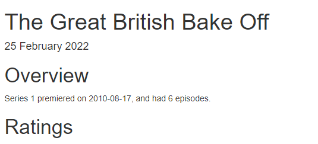

```{r setup, include=FALSE}
options(htmltools.dir.version = FALSE)
episode_counter <- 0
knitr::opts_chunk$set(
  collapse = TRUE,   
  comment = "#>"
)
```

```{r packages, include=FALSE}
library(countdown)
library(ymlthis)
library(tidyverse)
library(bakeoff)
library(xaringanExtra)

xaringanExtra::use_clipboard()
xaringanExtra::use_share_again() # need to get the slide button on html view

# Data used in inline code

top_viewers <- ratings %>% 
  filter(series == 1) %>% 
  top_n(1, viewers_7day)

```

class: title-slide, center, middle

<span class="fa-stack fa-4x">
  <i class="fa fa-circle fa-stack-2x" style="color: #ffffffcc;"></i>
  <strong class="fa-stack-1x" style="color:#e7553c;">`r rmarkdown::metadata$session`</strong>
</span> 

# `r rmarkdown::metadata$title`
---

class: inverse, center, middle

# <center>Inline code</center>

<span class="fa-stack fa-4x">
  <i class="fa fa-circle fa-stack-2x" style="color: #fff;"></i>
  <strong class="fa-stack-1x" style="color:#17a2b8;">`r (episode_counter <- episode_counter + 1)` </strong>
</span> 

???
Combining code with text!!

---

# <center>Inline text formatting</center>

.pull-left[

A single back tick denotes a `function` and changes the format

A single back tick with r denotes code to be run in R
``` `r knitr::inline_expr('top_viewers %>% pull(episode)')` ```

]

???
The following code will run from a dataset generated in the previous section of Code Chunks:

```{r eval=FALSE, echo=TRUE}
top_viewers <- ratings %>% 
  filter(series == 1) %>% 
  top_n(1, viewers_7day)

```


.pull-right[

Same word: `function`  

</br>
The top viewed episode in series 1 was episode
`r top_viewers %>% pull(episode)`

]

???
Inline code can be formatted on screen to be on multiple lines and will still run but the colouring changes:

`r top_viewers %>% 
pull(episode)`

and automatically indent formatting is lost. It's not a good idea to have a lot of code in inline for ease of debugging.

---

class: inverse, center, middle

# <center>Inline code - in the YAML</center>

<span class="fa-stack fa-4x">
  <i class="fa fa-circle fa-stack-2x" style="color: #fff;"></i>
  <strong class="fa-stack-1x" style="color:#17a2b8;">`r (episode_counter <- episode_counter + 1)` </strong>
</span> 

---
class: your-turn

# Your turn

In the file `01-bakeoff-report.Rmd` 

1 Add the following in the YAML and `r emo::ji("yarn")` **Knit** 

```{r echo = FALSE}
yml_empty() %>% 
  yml_date("2022-01-01") %>% 
  asis_yaml_output()
```

2 Replace the date with this code

```{r echo = FALSE}
yml_empty() %>% 
  yml_date("`r Sys.Date()`") %>% 
  asis_yaml_output()
```

3 Replace the date with this code

```{r echo = FALSE}
yml_empty() %>% 
  yml_date("`r lubridate::today()`") %>% 
  asis_yaml_output()
```


```{r echo = FALSE}
countdown(minutes = 3)
```

???
The quotation marks are very important, particularly with the inline code starting `r`

---
class: your-turn

# Answers

</br>

1. The date appears as we'd expect underneath the main title

1. Although the date is still in the YAML it is overwritten by the YAML code chunk to today's date

1. The date is the same but this uses a function with a more user-friendly name - which do you prefer?

---

class: inverse, center, middle

# <center>Inline code - formatting in the YAML</center>

<span class="fa-stack fa-4x">
  <i class="fa fa-circle fa-stack-2x" style="color: #fff;"></i>
  <strong class="fa-stack-1x" style="color:#17a2b8;">`r (episode_counter <- episode_counter + 1)` </strong>
</span> 

---

# <center>Friendly date formats</center>


.pull-left[

```{r echo = TRUE, eval = FALSE}
"`r format(Sys.time(), '%d %B %Y')`"
```
]

--

.pull-right[



]


---
class: inverse

# <center>Next section...</center>
