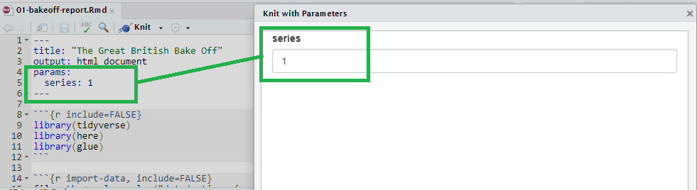
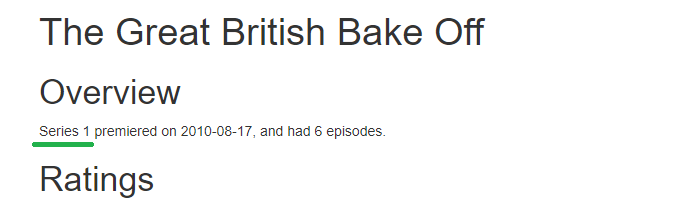

```{r setup, include=FALSE}
options(htmltools.dir.version = FALSE)
episode_counter <- 0
knitr::opts_chunk$set(
  collapse = TRUE,   
  comment = "#>"
)
```

```{r packages, include=FALSE}
library(countdown)
library(ymlthis)
library(tidyverse)
library(bakeoff)
library(xaringanExtra)

xaringanExtra::use_clipboard()
xaringanExtra::use_share_again() # need to get the slide button on html view
```

class: title-slide, center, middle

<span class="fa-stack fa-4x">
  <i class="fa fa-circle fa-stack-2x" style="color: #ffffffcc;"></i>
  <strong class="fa-stack-1x" style="color:#e7553c;">`r rmarkdown::metadata$session`</strong>
</span> 

# `r rmarkdown::metadata$title`

---
class: inverse, center, middle

# <center>Parameters in RStudio</center>

<span class="fa-stack fa-4x">
  <i class="fa fa-circle fa-stack-2x" style="color: #fff;"></i>
  <strong class="fa-stack-1x" style="color:#17a2b8;">`r (episode_counter <- episode_counter + 1)` </strong>
</span> 

---
# <center>Knit with Parameters</center>

```{r echo=FALSE, fig.alt="Screenshot of the knit dropdown menu", out.width="25%", fig.align='center'}
knitr::include_graphics("images/knit-dropdown.png")
```


```{r echo=FALSE, fig.alt="Screenshot of the YAML code that then appears in the wizard to select parameters", fig.align='center'}
 
```

???
This uses {shiny} and may be prompted to install for use

---

# <center>Inline Parameters</center>

.pull-left[
Report relates to Series ``` `r knitr::inline_expr('params$series')` ```

]

--

.pull-right[

]


---

# <center>R code Parameters</center>
---

# <center>R code Parameters</center>

.pull-left[

```{r eval=FALSE}

series_ratings <- ratings %>% 
  filter(series == params$series) #<<

```
]

--

.pull-right[

```{r}
ratings %>% 
  filter(series == params$series) %>% 
  head(5)
```

]

---

# <center>In chunk settings</center>

.pull-left[

```yaml
---
params:
  show_code: FALSE
---
```

]
--

.pull-right[

Also add this to the global options: 

`knitr::opts_chunk$set(echo = params$show_code)`
]

---

class: inverse, center, middle

# <center>Shiny Controls</center>

<span class="fa-stack fa-4x">
  <i class="fa fa-circle fa-stack-2x" style="color: #fff;"></i>
  <strong class="fa-stack-1x" style="color:#17a2b8;">`r (episode_counter <- episode_counter + 1)` </strong>
</span> 

---
# <center>Shiny Controls</center>

.pull-left[
```yaml
title: "The Great British Bake Off"
output: html_document
params:
  series: 
    label: "Series numbers"
    value: 1
    input: slider
    min: 1
    max: 9
    step: 1
```
]

.pull-right[

* label: text
* value: starting point
* input: type of wizard
* min: minimum that you set
* max: maximum that you set
* step: increments (default gives smaller points that don't match data)

]

???
The params: YAML code uses {shiny} which needs to be installed.

When searching for options related to types of `input` consider adding `shiny` 
to the search.

---
class: your-turn

# Your turn

`r emo::ji("yarn")` **Knit** button and `Knit with Parameters...` after each step

1. Install and add library() call for either [wesanderson](https://github.com/karthik/wesanderson) 

1. Add a new parameter called `palette:` spaced like `series:`

1. Add under the parameter:

```yaml 
label: "Give this a new name?"
value: Darjeeling1
input: select
choices: [GrandBudapest1, Darjeeling1, Darjeeling2, FantasticFox1, Royal2]
```

4. Add code to the ggplot2 to change the output colours: +
  `scale_colour_manual(values = wes_palette(params$palette))` 

_psst...`01-bakeoff-report-alison.Rmd` has all the code..._

_psst-psst...answer on the next slide..._


```{r echo = FALSE}
countdown(minutes = 5)
```

???

Issues may occur with grey pop up from shiny for some computers - possibly VPN/network issues.

---
class: your-turn

# Answer

```yaml
  palette: 
    label: "Wes Anderson palette:"
    value: GrandBudapest1
    input: select
    choices: [GrandBudapest1, Darjeeling1, Darjeeling2, FantasticFox1, Royal2]
```

---
class: inverse

# <center>Next section...</center>
