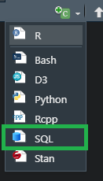

```{r setup, include=FALSE}
options(htmltools.dir.version = FALSE)
episode_counter <- 0
knitr::opts_chunk$set(
  collapse = TRUE,   
  comment = "#>"
)
```

```{r packages, include=FALSE}
library(countdown)
library(ymlthis)
library(tidyverse)
library(bakeoff)
library(xaringanExtra)

xaringanExtra::use_clipboard()
xaringanExtra::use_share_again() # need to get the slide button on html view
```

class: title-slide, center, middle

<span class="fa-stack fa-4x">
  <i class="fa fa-circle fa-stack-2x" style="color: #ffffffcc;"></i>
  <strong class="fa-stack-1x" style="color:#e7553c;">`r rmarkdown::metadata$session`</strong>
</span> 

# `r rmarkdown::metadata$title`

---

class: inverse, center, middle

# <center>RMarkdown to R and back again</center>

<span class="fa-stack fa-4x">
  <i class="fa fa-circle fa-stack-2x" style="color: #fff;"></i>
  <strong class="fa-stack-1x" style="color:#17a2b8;">`r (episode_counter <- episode_counter + 1)` </strong>
</span> 

---

# <center>RMarkdown to R and back again</center>

.pull-left[

When you have RMarkdown scripts you want to make to R

```{r eval=FALSE}
knitr::purl("01-bakeoff-report.Rmd", 
            documentation = 1)
```


]


???
`documentation =`
An integer specifying the level of documentation to add to the tangled script. 
0 means to output pure code, discarding all text chunks); 
1 (the default) means to add the chunk headers to the code; 
2 means to add all text chunks to code as roxygen comments. roxygen is used in packages

--

.pull-right[

When you have R script you want to make to RMarkdown

`r emo::ji("exclamation")` Note this will over-write scripts if they have the same name.

```{r eval=FALSE}

knitr::spin("spin-bakeoff-report.R", 
            knit = FALSE, 
            format = "Rmd")
```


]

???
Special hash and quote used from royxgen. Shortcuts need to be added manually but
can be search and replaced from an R document.

https://github.com/yihui/knitr/blob/master/inst/examples/knitr-spin.R

Also shortcut for comment and uncomment is the same `Ctrl + Shift + c`

---

class: inverse, center, middle

# <center>Knitting many documents</center>

<span class="fa-stack fa-4x">
  <i class="fa fa-circle fa-stack-2x" style="color: #fff;"></i>
  <strong class="fa-stack-1x" style="color:#17a2b8;">`r (episode_counter <- episode_counter + 1)` </strong>
</span> 

---

# <center>Knitting many documents</center>

.pull-left[
List the Rmd files:

```{r eval=FALSE}
files <- list.files(pattern = "[.]Rmd$")
```


Or list the Rmd files in a folder: 

```{r eval=FALSE}
files <- list.files(path = "03-images/", 
                    pattern = "[.]Rmd$")
```

]

.pull-right[
Use for loop code to run all the files:

```{r eval=FALSE}
purrr::map(
  .x = files,  
  .f = ~ rmarkdown::render(glue::glue(.x))
)
```


loop in a subfolder

```{r eval=FALSE}
purrr::map(
  .x = files, 
  .f = ~ rmarkdown::render(glue::glue("03-images/", .x))
)
```

]

---

class: inverse, center, middle

# <center>Source files</center>

<span class="fa-stack fa-4x">
  <i class="fa fa-circle fa-stack-2x" style="color: #fff;"></i>
  <strong class="fa-stack-1x" style="color:#17a2b8;">`r (episode_counter <- episode_counter + 1)` </strong>
</span> 

---

# <center>Source files</center>

Instead of using import data code in the RMarkdown it can be "sourced" from another script.

```{r eval=FALSE}

source("R/source_file_csv.R")

```

???
To show this use the `01-bakeoff-report.Rmd` and replace the `import-data` section with this code. The params$series don't need to be removed as this will still work.

---


class: inverse, center, middle

# <center>Using SQL chunks</center>

<span class="fa-stack fa-4x">
  <i class="fa fa-circle fa-stack-2x" style="color: #fff;"></i>
  <strong class="fa-stack-1x" style="color:#17a2b8;">`r (episode_counter <- episode_counter + 1)` </strong>
</span> 

---
class: center

# Using SQL chunks



---
class: live-code

# Using SQL chunks

Show and tell for this SQL code in an RMarkdown

* Open file `sql-chunks.Rmd`.  

* This file will knit but will just return code - there is no connection.

* Add the code `echo = FALSE` to the first chunk under `Default connection`.

SQL chunks options are supported the same options as R and can also be set globally.

---

# SQL Summary points

--

`r emo::ji("heavy_check_mark")` **It's not just R** RMarkdown combines text and other code (like SQL)

--

`r emo::ji("heavy_check_mark")` **Temporary tables - but in R** Creating tables of data in R is like creating temporary tables in SQL

--

`r emo::ji("heavy_check_mark")` **Use SQL power** R uses RAM so make use of the power of SQL servers

--

`r emo::ji("exclamation")` **Each temporary table is an object** Unlike in SQL you cannot create a temporary table and then refer to it in later code. You have to use CTEs

--

`r emo::ji("exclamation")` **nvarchar(max)** Some tables in SQL use nvarchar(max), varchar(max) or binary which cause your code to fail.  
The solution is to do a SELECT statement with the column at the end

--

`r emo::ji("exclamation")` **Debugging is hard** Errors don't come through from SQL so can be hard to debug from RStudio

--

`r emo::ji("exclamation")` **Case sensitivity** Microsoft SQL is not case sensitive and R is.

---

class: inverse

# <center>And that's the end...</center>

Special thanks to Alison Hill, Emi Tanaka and Desirée De Leon for the [original slides and content](https://ysc-rmarkdown.netlify.app/)

More special thanks to NHS-R Community and Hansel Palencia for the RMarkdown workshop run at the [2021 Conference](https://www.youtube.com/watch?v=RaM6fgwMZIs)

